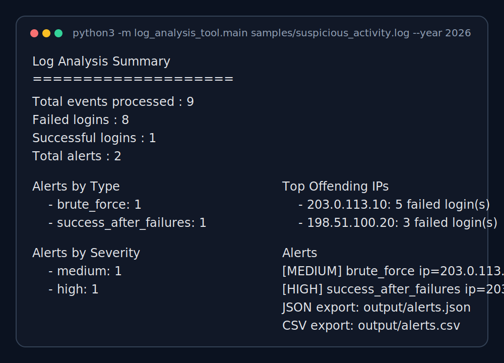
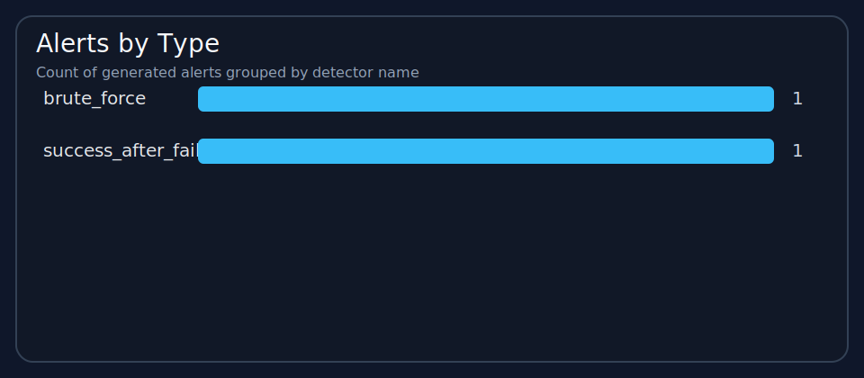
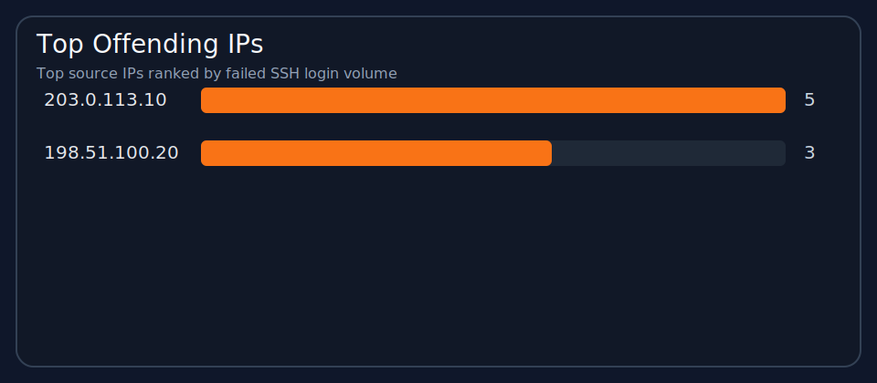

# log-analysis-tool

A Python command-line tool that parses Linux `auth.log` SSH authentication events and flags suspicious patterns. Built an entry-level cybersecurity portfolio project, practical enough to demonstrate real SOC-adjacent skills: structured log parsing, rule-based detection, edge-case testing, and exportable results.

---

## Cybersecurity Relevance

This project covers common SOC analyst tasks:

- Parsing raw authentication logs into structured events
- Detecting brute-force activity through repeated failed login attempts
- Correlating failed logins with a subsequent successful login from the same source IP
- Generating structured alerts suitable for triage or reporting
- Producing lightweight summary charts for quick review

---

## Architecture

```text
log_analysis_tool/
├── parser.py      # extracts SSH events from auth.log lines
├── detectors.py   # applies detection rules
├── models.py      # shared event and alert data models
├── exporters.py   # writes alerts to JSON and CSV
├── charts.py      # generates optional SVG charts
├── cli.py         # command-line argument handling
└── main.py        # program entry point
```

---

## Setup

```bash
python3 -m venv .venv
source .venv/bin/activate
python3 -m pip install -r requirements.txt
```

---

## Testing

See [TESTING.md](./TESTING.md) for detailed test scenarios and validation steps.

---

## Usage

### Run against a sample log

```bash
python3 -m log_analysis_tool.main samples/normal_activity.log --year 2026
python3 -m log_analysis_tool.main samples/suspicious_activity.log --year 2026
python3 -m log_analysis_tool.main samples/noisy_input.log --year 2026
```

### Export alerts to JSON and CSV

```bash
python3 -m log_analysis_tool.main samples/suspicious_activity.log \
  --year 2026 \
  --json-out output/alerts.json \
  --csv-out output/alerts.csv
```

### Generate summary charts

```bash
python3 -m log_analysis_tool.main \
  --input samples/suspicious_activity.log \
  --year 2026 \
  --output-json output/alerts.json \
  --output-csv output/alerts.csv \
  --generate-report \
  --report-dir output/report
```

### CSV export fields

| Field | Description |
|---|---|
| `timestamp` | Event timestamp |
| `alert_type` | Detection rule that triggered the alert |
| `severity` | Alert severity level |
| `source_ip` | Originating IP address |
| `username` | Targeted username |
| `count` | Number of relevant events |
| `description` | Human-readable alert summary |
| `reasoning` | Explanation of why the rule fired |

---

## Sample Output





**Suspicious activity log**

```text
Log Analysis Summary
====================
Total events processed : 9
Failed logins          : 8
Successful logins      : 1
Total alerts           : 2

Alerts by Type
  - brute_force: 1
  - success_after_failures: 1

Alerts by Severity
  - medium: 1
  - high: 1

Top Offending IPs
  - 203.0.113.10: 5 failed login(s)
  - 198.51.100.20: 3 failed login(s)

Alerts
------
[MEDIUM] brute_force ip=203.0.113.10 count=5 window=2026-01-12 10:00:00 -> 2026-01-12 10:04:00
  Reason: The IP reached the brute-force threshold of 5 failed logins inside a 10-minute window.
  Detail: 5 failed logins from 203.0.113.10 within 10 minutes

[HIGH] success_after_failures ip=203.0.113.10 count=5 window=2026-01-12 10:00:00 -> 2026-01-12 10:06:00
  Reason: The IP had at least 3 failed logins and then a successful login inside a 15-minute window.
  Detail: 5 failed logins followed by a success from 203.0.113.10 within 15 minutes

JSON export: output/alerts.json
CSV export:  output/alerts.csv
Report charts:
  - output/report/alerts_by_type.svg
  - output/report/top_offending_ips.svg
```

**Noisy input log**

```text
Log Analysis Summary
====================
Total events processed : 2
Failed logins          : 1
Successful logins      : 1
Total alerts           : 0

Alerts by Type
  None

Alerts by Severity
  None

Top Offending IPs
  - 203.0.113.50: 1 failed login(s)
```

---

## Limitations

- Supports only `Failed password` and `Accepted password` SSH events from Linux `auth.log`
- Requires a year to be supplied via `--year` or infers it from the current system year
- Uses simple threshold-based rules — no IP reputation, geolocation, or external enrichment
- Skips unsupported and malformed lines silently
- Produces static SVG charts rather than an interactive dashboard

---

## Potential Improvements

- Support additional SSH event types (e.g. public-key authentication)
- Make detection thresholds configurable via CLI flags
- Add per-username and per-IP summary statistics
- Package the tool with a `console_scripts` entry point for cleaner invocation
- Add an optional lightweight Flask dashboard on top of the existing CLI output

---

## Interview Talking Points

- Why structured parsing needs to happen before any alerting logic
- How rolling time windows enable simple but meaningful behavioural detections
- Why false positives and log quality are central concerns in security monitoring
- How the test suite covers edge cases including malformed lines, empty files, and threshold boundaries
- How this project could extend into a broader log analysis pipeline or SIEM enrichment workflow
